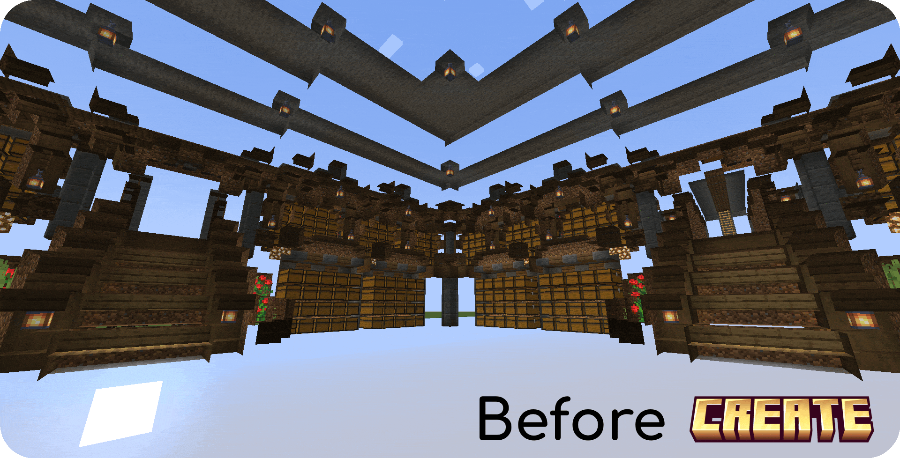
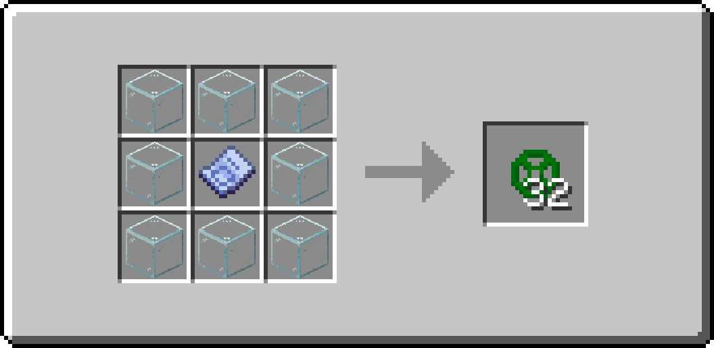
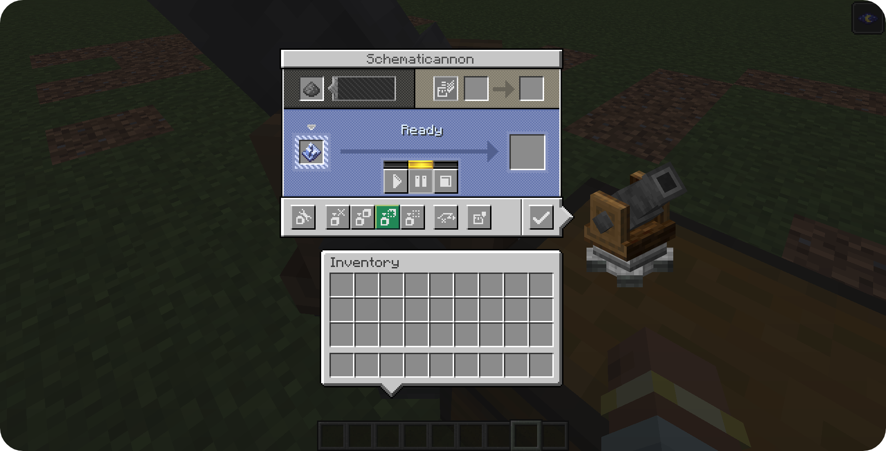

### 
Have you ever tried to use the Schematicannon to print a schematic containing a lot of air blocks (such as an underground base or a custom cave), only to have to go back and dig out all of the temporary blocks you've placed?

**Create: Schematic Void** solves these issues by allowing you to craft a technical block that causes the Schematicannon to print Air exactly where you want it.

Features
=======

* **Hollow Structures:** It allows you to print hollow structures or underground spaces directly, without needing to use temporary blocks that you have to break later.

* **Multi-language Support:** Create: Schematic Void has been translated into English (en_us) and Spanish (es_es).

* **Automatic Air Replacement:** The Schematicannon will replace Schematic Voids with clean air automatically.

* **Smart Material Requirements:** The Schematicannon won't ask you to put Schematic Voids inside its inventory to build the schematic.

* **Barrier-like Appearance:** To keep your schematics clean, Schematic Voids are invisible and will only show their texture when you hold one in your hand.

* **Survival Friendly:** The block is fully craftable in survival mode with this recipe:

How to Use
=======

1. Design your build and place the **Schematic Void** blocks in the areas you want to keep as Air.
2. Save your Schematic.
3. Place the Schematicannon and ensure that you change the mode to **"Replace Solid Blocks With Any"**:

4. Fire away! All of the Schematic Void blocks will be replaced with Air allowing you to create exact copies of your building.